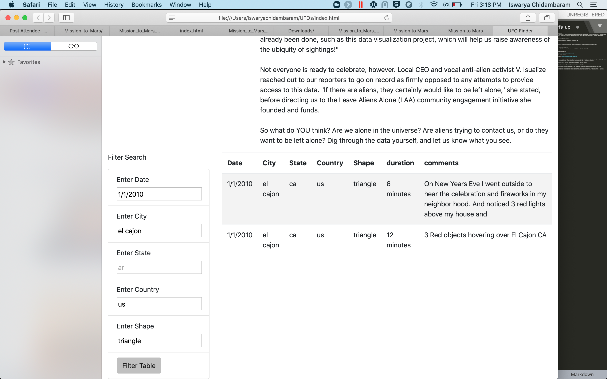

# Overview of the  Analysis:
The purpose of this analysis is to create a webpage with a dynamic working table which provides a more in-depth analysis of UFO sightings by allowing users to filter for multiple criteria at the same time. Filters for the date, city, state, country, and shape has been added

## Results:
* **Description of how to perform the search**: 

The table can be dynamically updated by changing the filters. For eg.When we set the filter as city to El Cajon and country to US and shape to traingle, we are getting 2 entries which are matching the filter condition

**Screenshot of table with the filter conditions**

## Summary:

* In this webpage we can only filter only one date at a time. Having the ability to select multiple dates will be useful in analysing the data.

**Recommendations to future improvement**

* Having radio buttons to select multiple entries in each filter can help us analyse better.

* Having a map displayed at the top and showing us the selected place when we select multiple cities in a filter will help us understand where the UFO's are actually functioning.